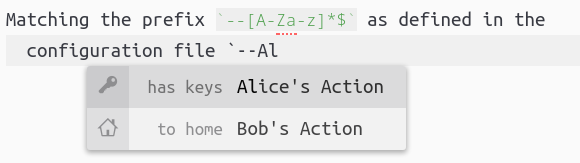

# Create autocomplete+ suggestions from CSV files

This package adds contents of user-defined files to the autocomplete+ suggestions list.

## Suggestions

Suggestions are loaded from a user-defined csv-file (custom delimiters possible) with the column headers as indicated in bold:

* **text** (required): the replacement text
* **display**: main UI text for the suggestion
* **left**: text to be shown left of the display text
* **right**: text to be shown right of the display text
* **className**: CCS class names
* **icon**: the octicons icon to be used (without the _icon-_ prefix)
* **description**: a description to be displayed on the bottom of the autocomplete box
* **url**: the URL linking to further information; is only shown when description is given

See also the [autocomplete+ documentation](https://github.com/atom/autocomplete-plus/wiki/Provider-API#suggestions) on suggestions.

## Configuration

All [autocomplete+ options](https://github.com/atom/autocomplete-plus/wiki/Provider-API#defining-a-provider) but `disableForSelector` and `onDidInsertSuggestion` can be  configured on a by file basis.
The GUI supports two files at the moment, but new files can easily added with new `provider`-entries in the `autocomplete-from-file` section in the `config.cson`.
Default values are applied to these as well.

All further settings are explained in the Settings panel;
please be aware that many settings provided for autocomplete+ will only apply after a restart, as I have not figured out yet how to reload a provider.

## Examples

```csv
text,icon,left,display
Bob goes home.,home,to home,Bob's Action
Alice has the keys.,key,has keys,Alice's Action
```

If the prefix `--[A-Za-z]*$` is matched `--Al` shows what is indicated in the screenshot, and would be replaced with `Alice has the keys.`



**On a more serious note**, I use this to load a file with [pandoc-crossref](http://lierdakil.github.io/pandoc-crossref/) references.
The references are generated via a `grep -rnP ' {#' | sed -re ...` script from all files in a project directory, so I can easily access them.
The loaded csv-file looks similar to this:

| text             | icon           | left             | display        | right           | class    |
| ---------------- | -------------- | ---------------- | -------------- | --------------- | -------- |
| sec:introduction | bookmark       | sec:introduction | Introduction   | introduction.md | header-1 |
| tbl:example      | list-unordered | tbl:example      | Example table  | another_file.md | table    |
| fig:example      | file-media     | fig:example      | Example Figure | third-file.md   | figure   |

And these are the corresponding settings;
the match prefix triggers the completion only when a colon occurs after an `@` to distinguish them from literature references.
The first matching group until the `@` is retained when selecting an auto completion:

```cson
provider1:
  enabled: true
  fileProvided: "/path/to/file.csv"
  matchPrefix: "((?:^|[ ;\\[])@)([\\w0-9_-]*:[\\w0-9_-]*)$"
  retainFirstCapture: true
  numberOfSuggestions: 10
  selector: ".text.md, .text.plain"
```
